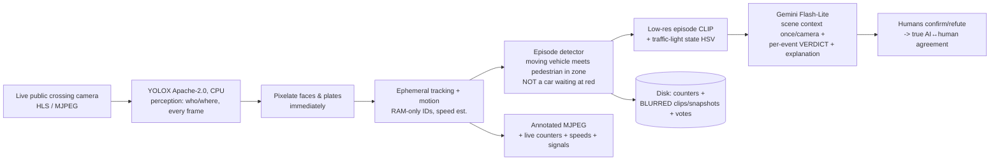

# Bezpieczne Przejścia / SafeCross

> ## ⚖️ Ethics & scope — read this first
> This is a **technical demonstrator of privacy-preserving road-safety
> analytics**. It is **NOT an enforcement system**: it identifies no persons,
> recognises no faces, keeps no register of offences, and imposes no
> penalties. Faces and licence plates are **pixelated before display or
> storage**; raw video frames are never persisted; no face embeddings ever
> exist. Only counters and **blurred** event snapshots are saved, for human
> verification. A production deployment requires a permissioned (or own)
> camera source, a lawyer-reviewed LIA + DPIA under GDPR **before real use**,
> and — for public-sector use — the authority's own legal basis with the
> supplier acting as processor (GDPR Art. 28). Enforcement stays with
> competent authorities.

**Bezpieczne Przejścia** (PL: "safe crossings") analyses a **real, live**
public crossing camera in real time: it counts pedestrians and vehicles,
**flags potential conflicts** (a vehicle in the crossing while a pedestrian is
present), snapshots each flagged moment, and lets the public **confirm or
refute** it — so the model's *true* accuracy is measured from human votes, not
claimed by a vendor. One sentence (PL): *Analiza wideo na żywo z prawdziwej
kamery przejścia — bez identyfikacji, bez rejestru, bez kar.*

Live demo (real camera): https://patrol.flyreelstudio.eu

## Architecture — three cheap models that cooperate

The design goal: approach the quality of an expensive "unlimited" AI agent
for **pennies**, by letting each model do only what it is best at.



- **YOLOX (local, free)** — fast perception, but no scene understanding.
- **Gemini Flash-Lite (pennies)** — (a) describes each crossing ONCE (lanes,
  signals, flows, and the *pitfalls* where a naive detector false-alarms, e.g.
  "cars waiting at a red light near the zebra"); (b) watches each flagged
  episode clip and returns a **verdict + plain-language explanation** (real
  violation, or why it is a false alarm). A hard daily call cap + circuit
  breaker keep cost near zero and the site up even if the LLM is unavailable.
- **Humans (free)** — verify every AI verdict; we publish the AI↔human
  agreement and collect the explanations as a dataset for improving detection.

Camera management + automatic failover: see [cv-service/CAMERAS.md](cv-service/CAMERAS.md).
Admin panel: `/admin.html`. Downloadable per-crossing reports: `/cv/report.html`, `/cv/report.csv`.

Key honesty mechanisms:
- **coverage_bucket** stores actually-observed seconds per interval; all
  rates are normalized to observed time and gaps render as **no-data,
  never zeros**.
- **Failover pool is bound to one crossing** — sources of the same view
  only, so statistics never mix locations. The repository contains a
  fact-test that kills the primary source mid-run and proves counters
  continue from the backup.
- **Panoramic framings degrade to counting only**; behavioural metrics
  (yield, head-down) require a tight framing; conflict times in seconds
  (PET/TTC) require a metrically calibrated camera.

## Licensing policy
Apache-2.0 code; detector weights Apache-2.0 (YOLOX / RT-DETR class).
**No AGPL components** — verified with `pip-licenses` (0 copyleft in the
served artifact).

## Run the tests (synthetic only)
```bash
python -m venv .venv && .venv/Scripts/pip install -r pipeline/requirements.txt
cd pipeline && ../.venv/Scripts/python -m pytest tests/ -q
```
The suite includes a full end-to-end run on **synthetic MJPEG streams**
(green/red rectangles — no real footage anywhere) with a live failover kill.

## Limitations (honest)
- Night / rain / snow reduce detection sensitivity (coverage makes it visible).
- Head-down % is a sampled proxy with wide CI — never a claim about a person.
- Camera speed estimation is screening-grade, never evidence.
- Semantic detector accuracy on real scenes is NOT claimed here — it requires
  staged, consented footage behind the legal gate.

## Author & contact
**Andrii Shramko** — computer vision / VR / 3D Gaussian Splatting specialist
(Poland). Commercial deployments, consulting, integrations:
zmei116@gmail.com · https://www.linkedin.com/in/andriishramko

Docs: [what-is](docs/what-is.md) · [method](docs/method.md) ·
[privacy & legal](docs/privacy-and-legal.md) · [FAQ](docs/faq.md) ·
[for governments](docs/for-governments.md) · [for companies](docs/for-companies.md)
