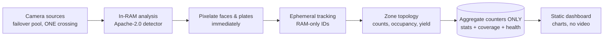

# Bezpieczne Przejścia / SafeCross

> ## ⚖️ Ethics & scope — read this first
> This is a **technical demonstrator of privacy-preserving road-safety
> analytics**. It is **NOT an enforcement system**: it identifies no persons,
> recognises no faces, keeps no register of offences, and imposes no
> penalties. All published data is **synthetic**. Faces and licence plates
> are pixelated during analysis; video frames are never stored; no face
> embeddings ever exist. A real deployment additionally requires: a
> permissioned (or own) camera source, a lawyer-reviewed LIA + DPIA under
> GDPR **before the first real frame**, and — for public-sector use — the
> authority's own legal basis with the supplier acting as processor
> (GDPR Art. 28). Enforcement stays with competent authorities.

**Bezpieczne Przejścia** (PL: "safe crossings") turns a camera view of ONE
pedestrian crossing into **anonymous aggregate safety metrics**:
pedestrians/hour, % head-down pedestrians (sampled attention proxy with
confidence intervals), drivers failing to yield (topological event),
conflict events — rendered as a chart dashboard (PL/EN). One sentence (PL):
*Anonimowy, zagregowany dashboard bezpieczeństwa przejść dla pieszych —
bez identyfikacji, bez rejestru, bez kar.*

Live demo: https://patrol.flyreelstudio.eu (synthetic data)

## Architecture



Key honesty mechanisms:
- **coverage_bucket** stores actually-observed seconds per interval; all
  rates are normalized to observed time and gaps render as **no-data,
  never zeros**.
- **Failover pool is bound to one crossing** — sources of the same view
  only, so statistics never mix locations. The repository contains a
  fact-test that kills the primary source mid-run and proves counters
  continue from the backup.
- **Panoramic framings degrade to counting only**; behavioural metrics
  (yield, head-down) require a tight framing; conflict times in seconds
  (PET/TTC) require a metrically calibrated camera.

## Licensing policy
Apache-2.0 code; detector weights Apache-2.0 (YOLOX / RT-DETR class).
**No AGPL components** — verified with `pip-licenses` (0 copyleft in the
served artifact).

## Run the tests (synthetic only)
```bash
python -m venv .venv && .venv/Scripts/pip install -r pipeline/requirements.txt
cd pipeline && ../.venv/Scripts/python -m pytest tests/ -q
```
The suite includes a full end-to-end run on **synthetic MJPEG streams**
(green/red rectangles — no real footage anywhere) with a live failover kill.

## Limitations (honest)
- Night / rain / snow reduce detection sensitivity (coverage makes it visible).
- Head-down % is a sampled proxy with wide CI — never a claim about a person.
- Camera speed estimation is screening-grade, never evidence.
- Semantic detector accuracy on real scenes is NOT claimed here — it requires
  staged, consented footage behind the legal gate.

## Author & contact
**Andrii Shramko** — computer vision / VR / 3D Gaussian Splatting specialist
(Poland). Commercial deployments, consulting, integrations:
zmei116@gmail.com · https://www.linkedin.com/in/andriishramko

Docs: [what-is](docs/what-is.md) · [method](docs/method.md) ·
[privacy & legal](docs/privacy-and-legal.md) · [FAQ](docs/faq.md) ·
[for governments](docs/for-governments.md) · [for companies](docs/for-companies.md)
