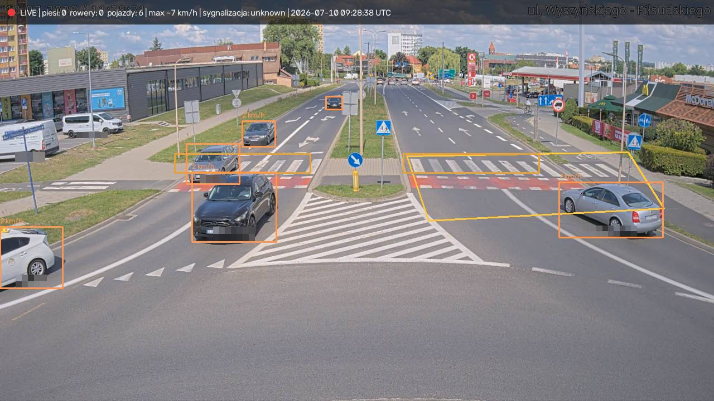
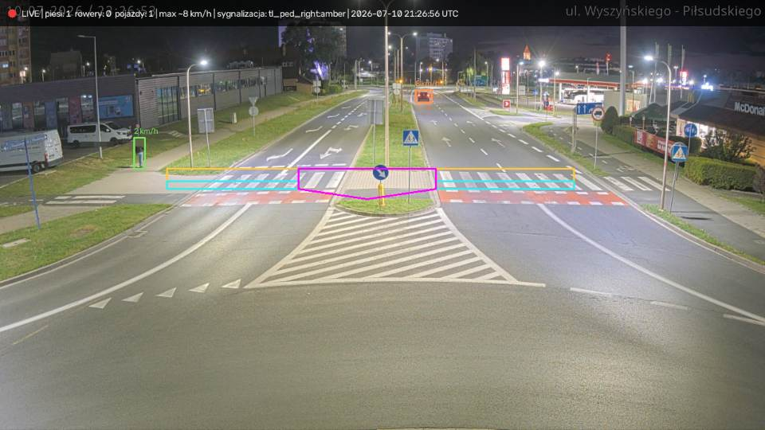

# Bezpieczne Przejścia / Safe Crossings

**Live, open, privacy-first pedestrian-crossing safety analytics** — a cooperating
three-model system watching a real public webcam over a pedestrian crossing in
Poland, 24/7, on a small CPU VPS.

**Live demo: [patrol.flyreelstudio.eu](https://patrol.flyreelstudio.eu)** (PL / EN)

## What it looks like

Live detection at day — every moving pedestrian / cyclist / vehicle is tracked,
speeds estimated, conflicts flagged in red on the stream and in recorded clips:



AI-calibrated zone map at night — yellow = pedestrian crossings, cyan = bike
crossings, magenta = refuge island (a pedestrian standing there is NOT in
conflict with the half they already crossed). The admin corrects every polygon
and rule in a visual editor; the AI never overwrites human edits:



More on the live site: event clips with AI verdicts in Polish + English,
one-click human verification, per-hour statistics, speeding-by-time-of-day
charts, and an automatic camera playlist.

**Contact:** the contact form on the [demo site](https://patrol.flyreelstudio.eu/#kontakt)
or [GitHub — @AndriiShramko](https://github.com/AndriiShramko).

Three "models" cooperate, each doing only what it is best at:

| Layer | Model | Job | Cost |
|---|---|---|---|
| Perception | **YOLOX-s** (ONNX, local CPU) | where are pedestrians / vehicles / bikes, every frame | free |
| Understanding | **Gemini Flash-Lite** (cloud) | scene context once per camera; verdict + PL/EN explanation once per flagged episode | free tier, hard-capped |
| Verification | **Humans** (site visitors) | vote on every AI verdict; agreement % is published | free |

The point is not "AI catches violations". The point is a **transparent, auditable
loop**: the machine flags and explains, people check, and the site publishes how
often the machine was right.

---

## Architecture

```
        public camera stream (HLS)
                    │
                    ▼
  ┌───────────────────────────────────┐
  │ Grabber thread                    │  HLS arrives in 2–3 s segment BURSTS;
  │ segment-burst-aware frame queue   │  keep every Nth frame in a bounded
  │ (thinned deque, ~1 segment lag)   │  deque instead of a keep-latest slot
  └────────────────┬──────────────────┘
                   ▼  paced at TARGET_FPS
  ┌───────────────────────────────────┐
  │ YOLOX-s ONNX on CPU               │  person / vehicle / bicycle;
  │ full frame + 1 motion-ROI pass    │  scene-context "ignore" boxes filter
  │                                   │  known static objects (poles, signs)
  └────────────────┬──────────────────┘
                   ▼
  ┌───────────────────────────────────┐
  │ trackers + motion gates           │  centroid trackers, MOG2 foreground,
  │ (confirm-by-motion, resurrection, │  confirm a track only after it MOVES;
  │  monocular speeds, stationary set)│  rough km/h per track
  └────────────────┬──────────────────┘
                   ▼
  ┌───────────────────────────────────┐
  │ multi-zone episode state machine  │  manual crossing polygon + every
  │ walking pedestrian × moving car   │  crossing the AI scene scan found;
  │ in the SAME zone at the same time │  pre/post-roll frame ring buffer
  └───────┬───────────────┬───────────┘
          │               ▼
          │   blurred low-fps episode clip (mp4v)
          │               │ background ffmpeg
          │               ▼
          │   H.264 (avc1) MP4 — playable in browsers
          │               │
          │               ▼
          │   Gemini verdict on an 8-frame sequence
          │   (+ scene context; budgeted free tier,
          │    429 → pause until quota reset → resume)
          │               │
          │               ▼
          │   crowd verification on the site (votes)
          ▼               ▼
   SQLite aggregates: counters, speeds, events, AI–human agreement
                   │
                   ▼
   /state.json · /events.json · /charts.json · CSV / HTML reports
```

Everything runs in one Python worker (`cv-service/worker.py`) plus a static site;
no GPU, no message broker, no external database.

## Key design decisions (and why)

### 0-AGPL licensing policy
The detector is **YOLOX (Apache-2.0)**, not an AGPL-licensed YOLO. The whole
dependency chain is permissive. **Why:** the target users are cities, road
authorities and companies — AGPL's network-copyleft clause is an instant legal
"no" in most of those organizations. A safety tool nobody can legally deploy
helps nobody.

### Privacy first
Heads and license plates are pixelated **before** any frame is displayed or
written to disk. Track IDs are ephemeral (RAM only), there are no embeddings and
no re-identification. Disk holds only aggregate counters, anonymous votes and
already-blurred, low-res episode clips with automatic pruning. **Why:** the
project's thesis is that road-safety monitoring can work *without* surveillance.
If the pipeline needed identities, the thesis would be false.

### Motion-confirmed counting
A track is counted only after it has existed for several frames **and** actually
moved a minimum distance; a MOG2 foreground mask provides an independent "is
anything really moving here" signal; a dead confirmed track that reappears
nearby inherits its confirmation instead of being counted again. **Why:** on a
cheap CPU detector at low fps, the dominant error is *static false positives* —
a pole or traffic light misread as a person would otherwise be "counted" forever,
and detector flicker on one car would count it three times.

### Episode kinematics: walking pedestrian × moving vehicle
An episode (potential conflict) starts only when, in the **same** crossing zone
at the same time, there is a confirmed pedestrian who is actually **walking**
(not standing on a refuge island) and a confirmed vehicle that is actually
**moving** (not politely stopped at the zebra or waiting at a red light). Zones
are the manually drawn crossing polygon **plus every crossing the AI scene scan
discovered**, so all zebras in view are monitored. **Why:** "pedestrian and car
in one polygon" fires constantly at any signalized crossing; requiring both
sides to be in motion is what separates a conflict from normal traffic.

### Segment-burst-aware frame queue
Live HLS does not deliver frames smoothly: a 2–3 s segment downloads and decodes
in a fraction of a second, then nothing until the next segment. A classic
keep-only-latest slot therefore yields ~1 usable frame per segment (0.3–0.8 fps)
and a jerky, freezing picture. Instead, a reader thread keeps every Nth frame in
a bounded deque and the processing loop consumes it evenly at `TARGET_FPS`, with
a constant ~one-segment latency. **Why:** smooth motion is not cosmetic — the
trackers, speed estimates and motion gates all assume roughly even frame spacing.

### mp4v → H.264 transcode
OpenCV's `VideoWriter` writes MPEG-4 Part 2 (`mp4v`), which **browsers cannot
play**. Every episode clip is re-encoded to H.264 (`avc1`) with `+faststart` by
a background thread using the static ffmpeg binary shipped in `imageio-ffmpeg`.
**Why:** crowd verification only works if any visitor can hit play instantly —
an unplayable clip is a lost human verdict.

### Free-tier AI budget with 429 pause/resume
Gemini calls are bounded by a daily cap (`AI_DAILY_CAP`) well under the free
quota. On HTTP 429 the client stops calling until the free-tier quota reset
(computed DST-proof) and then resumes automatically; it never retries into paid
territory. If AI is unavailable, events simply wait as pending — the site keeps
working. **Why:** the demo must be reproducible at **$0/month**; a project that
quietly starts billing its operator is not "cheap and open".

### Local-VLM fallback, wired and dormant
The AI layer supports `AI_BACKEND=local`: an Ollama-hosted open VLM (e.g.
`qwen2.5vl:3b`, Apache-2.0) with a circuit breaker that falls back to the cloud
free tier. It is fully wired but disabled by default: measured on a 4-vCPU CPU
box, one verdict took **2–3 minutes** — unusable for timely analysis. **Why keep
it:** the moment a GPU host is available, switching to a fully self-hosted,
no-cloud, better-privacy pipeline is a config change, not a rewrite.

## Honest limitations

- **~3 fps effective on 4 vCPU.** `TARGET_FPS` is only a ceiling; the loop is
  CPU-bound. Very fast events can fall between frames.
- **Monocular speeds are rough (±30% is a fair assumption).** A single
  meters-per-pixel scale, no homography, no calibration. Good enough for
  statistics and motion gating; never for enforcement.
- **The VLM can hallucinate.** Gemini sometimes misreads a scene or invents
  detail. Mitigation is structural, not cosmetic: every verdict is shown with
  its clip, every visitor can vote, and the AI–human agreement percentage is
  published.
- **A CPU-only local VLM is too slow today.** 2–3 min/call measured on a small
  CPU VPS — that is why the active backend is the cloud free tier.
- **Heuristics are heuristics.** Traffic-light state is HSV color sampling in
  AI-suggested boxes (often "unknown"); zones are 2D polygons, so perspective
  can blur "in the crossing" for tall vehicles.

## Run your own

You need: Docker, a public **HLS** camera URL (`.m3u8`) you are allowed to use,
and optionally a free Gemini API key.

```yaml
# docker-compose.yml
services:
  patrol-cv:
    build: ./cv-service          # downloads YOLOX-s ONNX at build time
    restart: unless-stopped
    environment:
      - TARGET_FPS=6
      - PROC_WIDTH=1280
      - CONF=0.30
      - AI_BACKEND=gemini
      - AI_DAILY_CAP=150
    env_file: ./cv.env           # secrets, chmod 600, never in git
    volumes:
      - ./cv-data:/data
    ports:
      - "8090:8090"
    mem_limit: 1600m
    cpus: 4.0
```

```bash
# cv.env
GEMINI_API_KEY=...     # optional; without it events wait for human review only
ADMIN_TOKEN=...        # protects /admin.html and the camera API
TG_BOT_TOKEN=...       # optional Telegram disk-guard alerts
TG_CHAT_ID=...
```

```bash
docker compose up -d --build
# live MJPEG + JSON APIs now on :8090; put a reverse-proxy front (nginx/Caddy)
# in front for TLS and to serve the static site from site/public/
```

### Environment variables

| Variable | Default | Meaning |
|---|---|---|
| `AI_BACKEND` | `gemini` | `gemini` (cloud free tier) or `local` (Ollama VLM) |
| `GEMINI_API_KEY` | — | Gemini key; empty = AI off, human-only review |
| `GEMINI_MODEL` | `gemini-3.1-flash-lite` | verdict/scene model |
| `AI_DAILY_CAP` | `150` | hard daily cap on AI calls (stay inside free tier) |
| `ADMIN_TOKEN` | — | token for `/admin.html` and `/admin/*` API |
| `VIDEO_URL`, `STREAM_REFERER` | — | seed camera for the first `cameras.json` |
| `TARGET_FPS` | `2` | processing fps ceiling (CPU-bound in practice) |
| `PROC_WIDTH` | `1280` | analysis frame width |
| `CONF` | `0.28` | detector confidence threshold |
| `CLIP_WIDTH` / `CLIP_FPS` | `640` / `2` | episode clip resolution / fps |
| `PRE_ROLL_S` / `POST_ROLL_S` | `6` / `3` | seconds of context around an episode |
| `MOVE_KMH_MIN` | `4` | below this a track counts as stationary |
| `CLIPS_MAX_GB` / `DISK_MIN_FREE_GB` | `2.0` / `2.0` | disk guard: prune clips, stop recording, alert |
| `OLLAMA_URL`, `OLLAMA_MODEL`, `LOCAL_*` | see `ai_analyst.py` | local VLM backend (needs a GPU host to be practical) |

### Cameras (`/data/cameras.json`, managed via `/admin.html`)

```json
{
  "active": "cam1",
  "cameras": [
    {
      "id": "cam1",
      "label": "Public label shown on the site (place + operator credit)",
      "url": "https://example.org/hls/cam1/index.m3u8",
      "referer": "https://example.org/",
      "poly": [[0.44, 0.62], [0.77, 0.60], [0.80, 0.80], [0.47, 0.84]],
      "m_per_px_fullw": 0.075
    }
  ]
}
```

- `poly` — the crossing zone, 4–6 points as **fractions 0..1** of frame size.
- `m_per_px_fullw` — meters per pixel at full frame width (for rough speeds).
- Multiple cameras form an automatic **failover pool** with per-camera stats.
- Source types: **HLS `.m3u8` (recommended)**, MJPEG, RTSP; YouTube usually
  fails from datacenter IPs (bot checks) — fine for home-connection tests only.
- On first sight of a camera the AI writes a one-time **scene context**
  (crossings, signals, static objects to ignore) to `/data/scenes/`.

### Useful endpoints

`/live.mjpg` (annotated stream) · `/state.json` (live counters + latest events) ·
`/events.json` · `/charts.json` · `/api/stats` · `POST /api/verify` (vote) ·
`/report.csv` / `/report.html` · `/healthz` · `/admin/cameras`, `/admin/health`
(token-gated).

## Repository layout

- `cv-service/` — the whole live pipeline: `worker.py` (ingest, detect, track,
  episodes, clips, HTTP API), `ai_analyst.py` (Gemini / local VLM layer),
  `db.py` (SQLite aggregates), `safecross/` (detector, blur, tracker, zones).
- `site/` — static site generator (PL root + `/en/`).
- `form-proxy/` — tiny contact-form → messenger proxy.
- `deploy/` — docker-compose files with hard resource caps + nginx config.
- `pipeline/` — earlier aggregate-only pipeline package with tests.

## Contributing

Issues and PRs welcome. Especially useful:

- tracking quality (better association than centroid tracking at ~3 fps),
- homography-based speed estimation from a few road measurements,
- local VLM benchmarks on GPU hosts (`AI_BACKEND=local` is ready to test),
- new public cameras (with the operator's permission) and translations.

Ground rules: keep the dependency chain **AGPL-free**, and keep privacy
guarantees intact (nothing un-blurred may ever be displayed or persisted).

## License

**Apache-2.0** — see [LICENSE](LICENSE). Author: Andrii Shramko.
